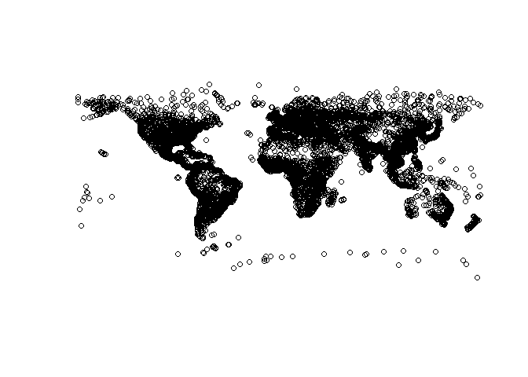
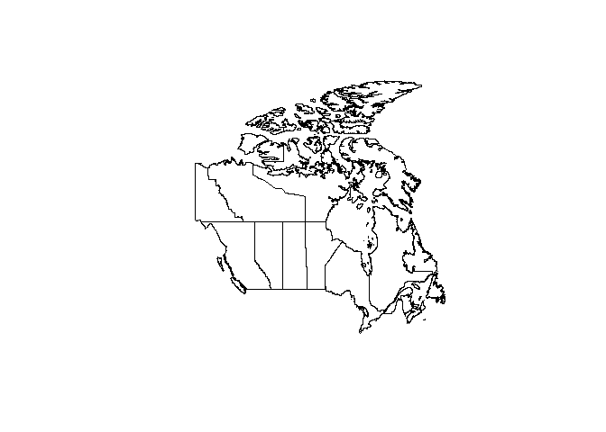
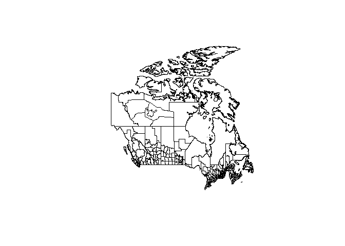
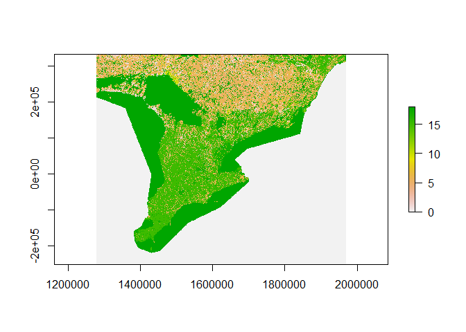

# Setup, Required Packages

```{r eval=FALSE, warning=FALSE}
loadpackages=function(packages){  for(p in packages){
  if(!require(p,character.only=T)){install.packages(p)}
  library(p,character.only=T,quietly=T,verbose=F)}}
loadpackages(c("devtools","raster","sp","sf"))
```

# Package Installation

```{r eval=FALSE}
options(timeout = 400) # Download time may approach 400 seconds
devtools::install_github("data-for-science/dfs_spatdat")
```

```{r}
library(dfsspatdat)
```

# Citations

### World Cities Data

Made with Natural Earth. Free vector and raster map data \@ naturalearthdata.com.


{width="50%"}


### Canada Census Data

[Population Ecumene Census Division Cartographic Boundary File - 2011 Census, Statistics Canada](https://open.canada.ca/data/en/dataset/5be03a46-8504-40a7-a96c-af195bae0428)

[Population and dwelling counts, for Canada and census divisions, 2016 and 2011 censuses, Statistics Canada](https://open.canada.ca/data/en/dataset/ece81c43-aa4e-41ef-86c2-3835eb5aa95c)

Provinces/Territories Shapefile

{width="50%"}

Census Divisions Shapefile

{width="50%"}

### Ontario Land Cover

[Canadian Landcover at 30-meter resolution 2015](http://www.cec.org/north-american-environmental-atlas/land-cover-30m-2015-landsat-and-rapideye/)

From the The North American Land Change Monitoring System (NALCMS)


Data has been cropped to Southern Ontario and downscaled to 90-meter resolution.

{width="50%"}