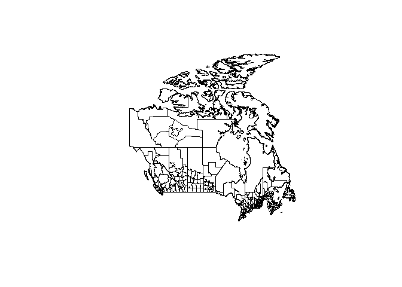
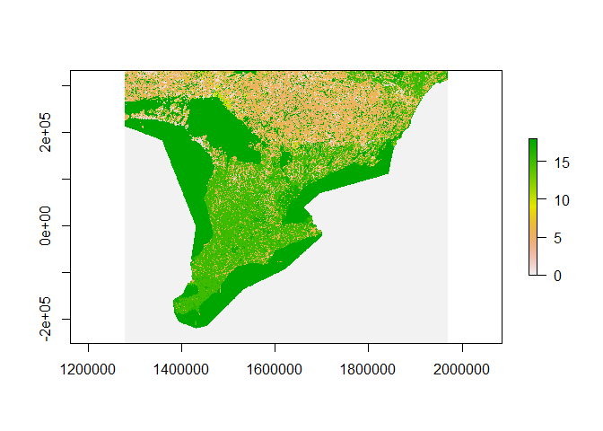

Data Processing and Cleaning
================
Tyler Hampton

## Natural Earth Data

### Download

``` r
utils::download.file(
  url = "https://www.naturalearthdata.com/http//www.naturalearthdata.com/download/10m/cultural/ne_10m_populated_places_simple.zip",
  destfile = "C:/Users/tbhampto/Downloads/ne_10m_populated_places_simple.zip"
)
utils::unzip(
  zipfile = "C:/Users/tbhampto/Downloads/ne_10m_populated_places_simple.zip",
  exdir = "data-raw/worldcities"
)
```

### Final Processing

``` r
worldcities = sf::st_read(file.path(
  "data-raw","worldcities",
  "ne_10m_populated_places_simple.shp"
),quiet=TRUE)

worldcities$adm1name = stringi::stri_trans_general(
  worldcities$adm1name,
  "latin-ascii"
)

worldcities = worldcities[,c(
  "nameascii","featurecla","adm0cap","worldcity",
  "sov0name","adm0name","adm1name",
  "sov_a3","adm0_a3","iso_a2",
  "latitude","longitude",
  "pop_max","pop_min","geometry"
)]

plot(sf::st_geometry(worldcities))
```

<!-- -->

``` r
sf::st_write(worldcities,"data-shp/worldcities.shp",append=FALSE)
```

    ## Deleting layer `worldcities' using driver `ESRI Shapefile'
    ## Writing layer `worldcities' to data source 
    ##   `data-shp/worldcities.shp' using driver `ESRI Shapefile'
    ## Writing 7342 features with 14 fields and geometry type Point.

    ## Warning in CPL_write_ogr(obj, dsn, layer, driver,
    ## as.character(dataset_options), : GDAL Message 1: One or several characters
    ## couldn't be converted correctly from UTF-8 to ISO-8859-1.  This warning will
    ## not be emitted anymore.

``` r
usethis::use_data(worldcities,overwrite=TRUE)
usethis::use_r("worldcities")
```

## Canada Census Information

### Download

[Canada Census
Shapefile](https://open.canada.ca/data/en/dataset/5be03a46-8504-40a7-a96c-af195bae0428)

``` r
utils::download.file(
  url = "https://www12.statcan.gc.ca/census-recensement/2011/geo/bound-limit/files-fichiers/gecu000e11a_e.zip",
  destfile = "C:/Users/tyler/Downloads/gecu000e11a_e.zip"
)
utils::unzip(
  zipfile = "C:/Users/tyler/Downloads/gecu000e11a_e.zip",
  exdir = "data-raw/CanadaCensusShapes"
)
```

[Canada Census Pop
Data](https://open.canada.ca/data/en/dataset/ece81c43-aa4e-41ef-86c2-3835eb5aa95c)

``` r
utils::download.file(
  url = "https://www12.statcan.gc.ca/census-recensement/2016/dp-pd/hlt-fst/pd-pl/Tables/CompFile.cfm?Lang=Eng&T=701&OFT=FULLCSV",
  destfile = "data-raw/CanadaCensusData/CanadaCensusData.csv"
)
```

### Final Processing

``` r
can_cdiv = sf::st_read("data-raw/CanadaCensusShapes/gcd_000e11a_e.shp",quiet=TRUE)
plot(sf::st_geometry(can_cdiv))
```

<!-- -->

``` r
usethis::use_data(can_cdiv,overwrite=TRUE)
usethis::use_r("can_cdiv")
```

``` r
can_prov = sf::st_read("data-raw/CanadaCensusShapes/gpr_000e11a_e.shp",quiet=TRUE)
plot(sf::st_geometry(can_prov))
```

<!-- -->

``` r
usethis::use_data(can_prov,overwrite=TRUE)
usethis::use_r("can_prov")
```

``` r
can_cendat = read.csv("data-raw/CanadaCensusData/CanadaCensusData.csv")

can_cendat = can_cendat[,c(
  "Geographic.code",
  "Geographic.name..english",
  "Geographic.type..english",
  "Province...territory..english",
  "Geographic.code..Province...territory",
  "Population..2016",
  "Population..2011",
  "Population....change",
  "Total.private.dwellings..2016",
  "Total.private.dwellings..2011",
  "Total.private.dwellings....change",
  "Land.area.in.square.kilometres..2016",
  "Population.density.per.square.kilometre..2016",
  "National.population.rank..2016",
  "Provincial.territorial.population.rank..2016"
)]

names(can_cendat) = c(
  "CDUID",
  "CDNAME",
  "CDTYPE",
  "PRNAME",
  "PRUID",
  "pop.16",
  "pop.11",
  "pop.chg",
  "dwel.16",
  "dwel.11",
  "dwel.chg",
  "landarea.sqkm",
  "popdens.sqkm",
  "poprank.nat",
  "poprank.prov"
)
  
can_cendat$CDNAME = sapply(can_cendat$CDNAME,function(n){
  if(stringi::stri_enc_isascii(n)){
    return(n)
  }else{
    stringi::stri_trans_general(
      iconv(n, "latin1", "utf-8"),
      "latin-ascii")
    # if(grepl("<",n)){
    #   position = unlist(gregexpr("<",n, fixed = TRUE))
    #   char = substr(n,position,position+3)
    #   sub = paste0("\\u00",substr(char,2,3))
    #   special = stringi::stri_unescape_unicode("\\u00e9")
    #   replace = stringi::stri_trans_general(special, "latin-ascii")
    #   
    #   fixed = gsub(char,replace,n)
    # }
  }
})
  
  
can_cendat$CDTYPE = factor(can_cendat$CDTYPE,
                           levels = unique(can_cendat$CDTYPE),
                           labels = c(
                             "Census division","County","Territoire equivalent",
                             "Municipalite regionale de comte",
                             "United counties","Regional municipality",
                             "District municipality","District",
                             "Regional district","Region","Territory",""
                           )
                           )


head(can_cendat)
```

    ##   CDUID          CDNAME          CDTYPE                    PRNAME PRUID pop.16
    ## 1  1001 Division No.  1 Census division Newfoundland and Labrador    10 270348
    ## 2  1002 Division No.  2 Census division Newfoundland and Labrador    10  20372
    ## 3  1003 Division No.  3 Census division Newfoundland and Labrador    10  15560
    ## 4  1004 Division No.  4 Census division Newfoundland and Labrador    10  20387
    ## 5  1005 Division No.  5 Census division Newfoundland and Labrador    10  42014
    ## 6  1006 Division No.  6 Census division Newfoundland and Labrador    10  38345
    ##   pop.11 pop.chg dwel.16 dwel.11 dwel.chg landarea.sqkm popdens.sqkm
    ## 1 262410     3.0  131336  120500      9.0       9220.61         29.3
    ## 2  21351    -4.6   11497   11648     -1.3       6099.08          3.3
    ## 3  16306    -4.6    8289    8346     -0.7      19912.67          0.8
    ## 4  20840    -2.2   11338   11232      0.9       7087.65          2.9
    ## 5  41004     2.5   20924   19287      8.5      10366.48          4.1
    ## 6  37304     2.8   19296   18537      4.1      16238.16          2.4
    ##   poprank.nat poprank.prov
    ## 1          26            1
    ## 2         219            8
    ## 3         249           10
    ## 4         218            7
    ## 5         145            2
    ## 6         151            3

``` r
usethis::use_data(can_cendat,overwrite=TRUE)
usethis::use_r("can_cendat")
```

## Ontario Land Cover

### Download

``` r
options(timeout=300)
utils::download.file(
  url = "http://www.cec.org/files/atlas_layers/1_terrestrial_ecosystems/1_01_1_land_cover_2015_30m/can_land_cover_2015v3_30m_tif.zip",
  destfile = "C:/Users/tbhampto/Downloads/can_land_cover_2015v3_30m_tif.zip"
)
utils::unzip(
  zipfile = "C:/Users/tbhampto/Downloads/can_land_cover_2015v3_30m_tif.zip",
  exdir = "C:/Users/tbhampto/Downloads"
)
```

``` r
lc_can = raster::raster(file.path(
  "C:/Users/tbhampto/Downloads",
  "can_land_cover_2015v3_30m_tif",
  "CAN_NALCMS_landcover_2015v3_30m",
  "data",
  "CAN_NALCMS_landcover_2015v3_30m.tif"
))
crop = sf::st_set_crs(
  sf::st_as_sf(
    sf::st_sfc(
      sf::st_polygon(
        list(matrix(c(
          c(-83.5,-83.5,-76,-76,-83.5),
          c(41.5,45.5,45.5,41.5,41.5)),ncol=2)
        )
      )
    )
  ),4326
)
names(crop) = "geometry"
sf::st_geometry(crop) <- "geometry"
crop = sf::st_transform(crop,sf::st_crs(lc_can))

ontario_lc = raster::crop(lc_can,crop)

raster::writeRaster(x = ontario_lc,
                    file.path(
  "C:/Users/tbhampto/Downloads",
  "can_land_cover_2015v3_30m_tif",
  "CAN_NALCMS_landcover_2015v3_30m",
  "data",
  "ONTARIO_NALCMS_landcover_2015v3_30m.tif"
))
```

### Final Processing

``` r
ontario_lc_30m = terra::rast(file.path(
  "C:/Users/tbhampto/Downloads",
  "can_land_cover_2015v3_30m_tif",
  "CAN_NALCMS_landcover_2015v3_30m",
  "data",
  "ONTARIO_NALCMS_landcover_2015v3_30m.tif"
))

ontario_lc_90m = terra::aggregate(
  ontario_lc_30m,
  fact=3,
  fun=modal,
  na.rm=TRUE)

raster::writeRaster(x = ontario_lc_90m,
                    file.path(
  "data-raw","canada_2015_land_cover",
  "landcover_SouthernOntario.tif"
),overwrite=TRUE)
```

``` r
ontario_lc = raster::raster(file.path(
  "data-raw","canada_2015_land_cover",
  "landcover_SouthernOntario.tif"
))

raster::plot(ontario_lc)
```

<!-- -->

``` r
usethis::use_data(ontario_lc,overwrite=TRUE)
usethis::use_r("ontario_lc")
```

## EBird Status and Trends

The eBird project has multiple data products that can be used for
academic research or hobby science.

<https://science.ebird.org/en>

The Status and Trends data are processed data products with time series
and rasterized formats. <https://science.ebird.org/en/status-and-trends>

You need an access key to access eBird data:
<https://science.ebird.org/en/status-and-trends/download-data>

``` r
set_ebirdst_access_key()
```

The “ebirdst” package interfaces with the eBird API to download data
directly to your computer and load into R.
<https://cornelllabofornithology.github.io/ebirdst/index.html>

``` r
#?ebirdst

# where ebirdst will store data
path = ebirdst_data_dir()
path = "C:/Users/Tyler/AppData/Roaming/R/data/R/ebirdst"
```

``` r
# Eastern Bluebird
ebirdst_download(species = "easblu",tifs_only=TRUE,show_progress = FALSE)
# Bobolink
ebirdst_download(species = "boboli",tifs_only=TRUE,show_progress = FALSE)
```

``` r
blue = load_raster(path=file.path(path,"2020/easblu"),product="occurrence",period="full-year",resolution = "hr")
bobo = load_raster(path=file.path(path,"2020/boboli"),product="occurrence",period="full-year",resolution = "hr")

clip = st_transform(Ontario,st_crs(blue)$proj4string)

blue_clip=raster::crop(blue,clip)
blue_clip = blue_clip %>% projectRaster(crs=Proj_AEA_Can)
blue_clip=raster::mask(blue_clip,Ontario)
writeRaster(blue_clip,filename = "data-raw/EBirdData/easblu_occur_year_Ontario",overwrite=TRUE)

bobo_clip=raster::crop(bobo,clip)
bobo_clip = bobo_clip %>% projectRaster(crs=Proj_AEA_Can)
bobo_clip=raster::mask(bobo_clip,Ontario)
writeRaster(bobo_clip,filename = "data-raw/EBirdData/boboli_occur_year_Ontario",overwrite=TRUE)
```

``` r
easblu_on = raster::raster("data-raw/EBirdData/easblu_occur_year_Ontario.grd")
raster::plot(easblu_on,main = "Eastern Bluebird Frequency in Ontario")
```

<!-- -->

``` r
raster::writeRaster(easblu_on,"data-shp/easblu_on.grd",overwrite=TRUE)
```

``` r
usethis::use_data(easblu_on,overwrite=TRUE)
usethis::use_r("easblu_on")
```

``` r
boboli_on = raster::raster("data-raw/EBirdData/boboli_occur_year_Ontario.grd")
raster::plot(boboli_on,main = "Bobolink Frequency in Ontario")
```

<!-- -->

``` r
raster::writeRaster(boboli_on,"data-shp/boboli_on.grd",overwrite=TRUE)
```

``` r
usethis::use_data(boboli_on,overwrite=TRUE)
usethis::use_r("boboli_on")
```

## Canadian Aboveground Biomass

<https://ftp.maps.canada.ca/pub/nrcan_rncan/Forests_Foret/canada-forests-attributes_attributs-forests-canada/2011-attributes_attributs-2011/NFI_MODIS250m_2011_kNN_Structure_Biomass_TotalLiveAboveGround_v1.tif>
